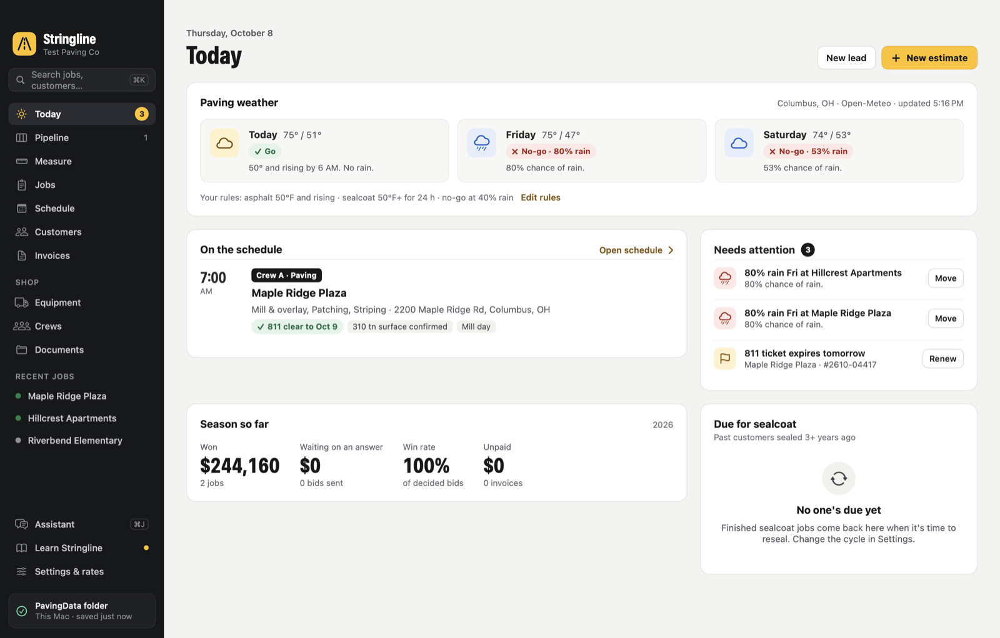
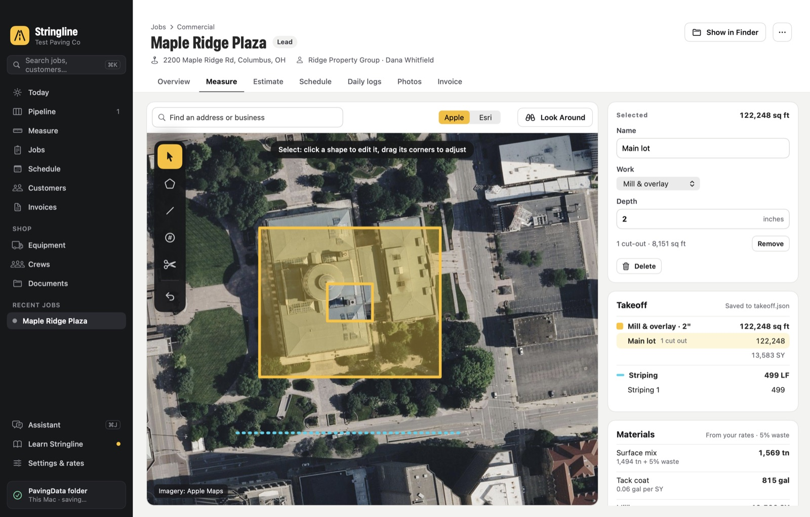
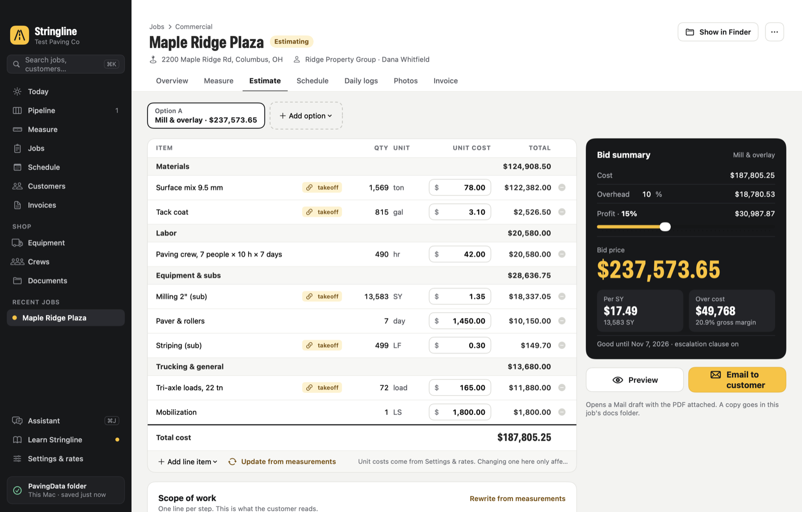
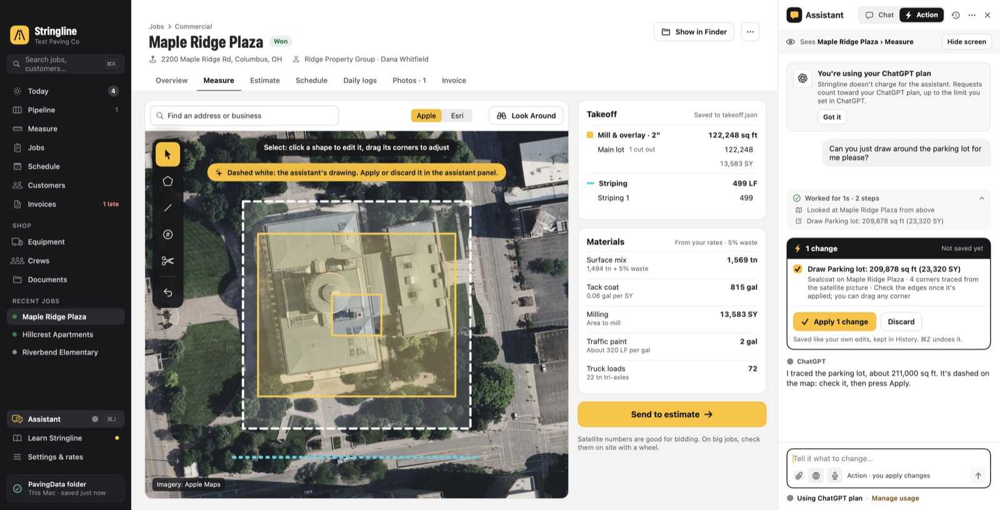
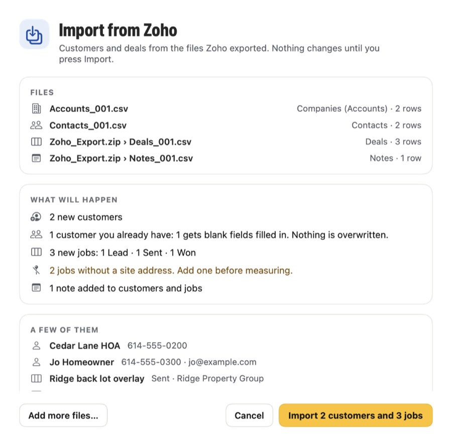

# Stringline

**A native Mac app for running a paving company.** Measure lots from satellite imagery, build estimates from your own rates, send proposals, run the pipeline and crew schedule, track daily logs, and get paid. A built-in ChatGPT assistant knows which screen you're on, answers how-to questions step by step, and can make changes for you (even draw on the map), but nothing is saved until you press Apply.

SwiftUI · macOS 14 or later · Apple silicon · no outside libraries · no database server · your data stays in plain files you own.



| Measure from satellite | Estimate from your rates |
|---|---|
|  |  |
| **The assistant draws the lot** | **Import from Zoho** |
|  |  |

## Contents

- [Download and install](#download-and-install)
- [What it does](#what-it-does)
- [AI assistant](#ai-assistant)
- [Import from Zoho](#import-from-zoho)
- [Your data](#your-data)
- [Updating](#updating)
- [Building from source](#building-from-source)
- [Tests](#tests)
- [Project layout](#project-layout)
- [Notes](#notes)

## Download and install

1. Download `Stringline.zip` from the latest [release](../../releases/latest) and double-click it to unzip.
2. Drag **Stringline.app** into your **Applications** folder.
3. Open it. The app is signed to run locally, not notarized by Apple, so macOS blocks it the first time:
   - **macOS 15 and later:** open **System Settings › Privacy & Security**, scroll down to the message about Stringline, and click **Open Anyway**. Then confirm.
   - **macOS 14:** Control-click the app, choose **Open**, then **Open**.
   - Or, in Terminal: `xattr -dr com.apple.quarantine /Applications/Stringline.app`

The first launch shows a welcome screen and a four-step setup: your company, where your data lives (iCloud Drive or a folder on this Mac), your services and rates, and where to start.

**Requirements:** a Mac with Apple silicon running macOS 14 Sonoma or later. Address suggestions as you type need macOS 15 or later. Maps, weather and the assistant need an internet connection; everything else works offline.

## What it does

- **Today:** go/no-go weather from your own rules (Open-Meteo, free and keyless), today's crews, and what needs attention: rain on job days, 811 tickets, quiet bids and late invoices. Also season totals, and past customers due for sealcoat.
- **Pipeline:** a drag-and-drop board from Lead to Won, with follow-up tags after 7 days.
- **Measure:** Apple satellite imagery (Esri as a backup). Draw areas with cut-outs, lines and count markers, drag corners to adjust, undo, and use keyboard shortcuts (A, L, C, X, V, Return, Esc, ⌘Z) and Look Around.
- **Estimate:** built from the takeoff and your rates, with editable lines, options A/B/C, a profit slider, price per SY, and a benchmark against your past jobs.
- **Proposal PDF:** a satellite snapshot with the measured areas drawn in, emailed through a Mail draft.
- **Schedule:** a week grid by crew with go/no-go checks for each job day, 811 tickets, plant orders, and export to Apple Calendar.
- **Jobs and customers:** daily logs that compare actuals with the bid, photos, and invoices (PDF, aging, mark paid).
- **Address suggestions:** address fields suggest real addresses from Apple Maps as you type: New Lead, a job's address, billing and mailing addresses, home base, and Measure's search. Pick one with ↓ and Return, or click it. On a job this also sets its spot on the map, so Measure opens on the lot. It uses MapKit, so no account or key is needed.
- **Import from Zoho:** customers, contacts, deals, leads and notes from Zoho CRM, Bigin, or Zoho Books and Invoice. [More below](#import-from-zoho).
- **Works with your Mac:** Apple Maps for drive times, directions and places; Mail and Messages drafts you send yourself; Apple Calendar; Siri, Shortcuts and Spotlight ("Ask Stringline"); dictation; notifications.
- **Learning:** first-launch setup, a six-stop guided tour, nine lessons, and the Practice Plaza sample job.

Equipment and Documents are placeholders for a later version.

## AI assistant

Press **⌘J** (or **Assistant** in the sidebar). It always knows which screen you're on, so "this estimate" or "this job" just works. The bar under its header shows what it can see; **Hide screen** turns that off.

### Connecting

- **Continue with ChatGPT** (Settings › AI assistant) signs in through OpenAI in your browser. Stringline waits on `127.0.0.1` for the browser to come back, checks the reply, and keeps the sign-in in this Mac's Keychain, never in your data folder and never synced. It never sees your password.
- **Which accounts work.** Requests count toward your ChatGPT plan, which OpenAI offers to personal **Plus and Pro** accounts. ChatGPT Business, Enterprise and Edu workspaces may not allow apps to use the plan; OpenAI then says your organization hasn't enabled the app, and Stringline explains what to do.
- **Choosing an account.** A sign-in stays tied to the account and workspace you picked the first time. **Use a different ChatGPT account or workspace** lets you pick again.
- **Or use an OpenAI API key.** It works with any account, and OpenAI bills it per use.

### Ask how to do anything

A built-in help library of about 50 short articles is written against the real buttons and menus. Ask "How do I add an option B?" and the assistant answers in numbered steps with button names in bold, then puts a pulsing ring on the right spot on screen. "Where am I?" explains the screen you're on. **Help › Ask Stringline Help…** (⇧⌘/) opens it straight away.

### Chat and Action

- **Chat** answers, looks things up and points at things. It can't change anything.
- **Action** lines up changes on a card: estimate lines, markup and scope, drawings on the map, leads, job details and stages, schedule days, daily logs, customers, invoices, rates and settings.
  - **Nothing is saved until you press Apply.** You can untick any change first, the card shows the bid price before and after, and ⌘Z puts everything back.
  - **You can follow and steer it.** A progress card lists each step, Esc stops it, you can type to steer it while it works, and it pauses after 20 steps.

### Drawing on the map

Ask "Draw around the parking lot" or "Fix my outline on the north side."
- **How it draws.** The assistant looks at the lot from above, in Apple Maps' satellite view with a 0–1000 grid and your existing shapes. Then it traces areas, lines, cut-outs and markers on that grid.
- **You check it first.** Its drawing shows on Measure as a dashed white outline, and the map moves to it. Apply or Discard it, then drag any corner to fine-tune.
- **Close, not survey-exact.** Drawings from the satellite picture are approximate.

### Chat features

- **Replies:** proper lists and steps, plus Copy, Read aloud, Try again, and Edit on your last message.
- **Attachments:** pictures and PDFs, such as a photo of a lot or a set of plans.
- **Web search:** answers list their sources.
- **Dictation**, and **saved chats** kept only on this Mac.

### Safety rules

These are enforced by the app, not left to the AI:
- **Changes only happen when you press Apply.**
- **Some changes stay unticked until you tick them:** Mail drafts, text messages, Calendar exports, marking an invoice paid, changing a rate, and changing settings.
- **Stringline never sends an email or a text,** and it can't delete jobs, customers or photos.
- **Nothing is applied when saving isn't safe:** while saving is paused, over a file that couldn't be read, or into a file waiting on a conflict.
- **Undo only puts back records you haven't edited since.**
- **Text inside your data, attachments or web pages is treated as data, never as instructions.**
- **Every turn ends with something you can see:** an answer, a change, or a message with **Try again**.
- **Each kind of change can be turned off** in Settings.

**What's sent to OpenAI:** your message and attachments, the screen you're on and the records on it, and anything it looks up (including the satellite picture when it looks at a lot). Customer phone numbers and emails are left out unless you turn them on. Requests are sent with `store: false`.

## Import from Zoho

Export your data from Zoho as CSV files, then choose **File › Import from Zoho…** (also on the Customers screen and in Settings › Data & backups) and pick them all at once. A .zip that Zoho downloaded works too.

- **What to export.**
  - **Zoho CRM:** use Setup › Data Administration › Export for Accounts, Contacts and Deals, plus Leads and Notes if you use them. Include all fields, so the Record Id columns come along.
  - **Bigin:** export Companies, Contacts and Deals.
  - **Zoho Books or Invoice:** export Customers.
  - Stringline recognizes each file from its columns.
- **What it becomes.**
  - Companies become customers. Their first contact becomes the contact person, and other contacts go in the notes.
  - Deals become jobs at the matching stage (Closed Won is Won, Proposal is Sent), with the closing date as the bid due date and the amount in the notes.
  - Leads become customers, plus a job at the Lead stage if you want one.
  - Notes land on their customer or job.
- **Nothing changes until you press Import.** The preview shows new customers, new jobs by stage, customers you already have, jobs without a site address, and every skipped row with the reason.
- **No duplicates, nothing overwritten.** Existing customers are matched by email, phone or name, and only their blank fields are filled in. Importing the same files again adds nothing.
- **One undoable step.** Click **Undo import** or press ⌘Z.

## Your data

Everything is plain JSON in one folder, `PavingData`, which you choose during setup (iCloud Drive is recommended):

```
PavingData/
  settings.json      company, weather rules, proposal wording, crews
  rates.json         prices and quantities used by every estimate
  logo.png
  in-use.json        which Mac has Stringline open (only while it's open)
  customers/<id>.json
  jobs/2026-001-maple-ridge-plaza/
    job.json  takeoff.json  estimate.json  logs.json  invoice.json
    photos/   docs/          (proposal and invoice PDFs land in docs)
  backups/           nightly zip of the JSON files, last 30 kept
```

Each Mac also keeps History (every version of every file, in SQLite), a second copy of the backups, and set-aside files in `~/Library/Application Support/Stringline`. That folder never syncs.

**How it's kept safe:**
- **Saves can't be half-written.** Each save writes a temporary copy, forces it to disk (`F_FULLFSYNC`), reads it back, then swaps it into place in one step, coordinated with iCloud.
- **A file that can't be read is never written over.** That covers files still downloading from iCloud, damaged files (put back from History automatically), and files saved by a newer version.
- **A stuck iCloud never freezes the app.** Waits on iCloud give up after a few seconds. Changes are kept on the Mac and save by themselves when iCloud answers again.
- **Startup never mistakes a problem for a fresh start.** A folder that's missing, offline or damaged gets a "Your data is safe" screen, not setup.
- **Changes from another Mac are never overwritten.** Stringline asks which version to keep, and the other version stays in History.
- **One Mac saves at a time.** It shows who has the folder open, and you can take over.
- **History.** Every save is kept for two weeks, then hourly back to 90 days, then daily for two years. Any file, or a whole deleted job, can be put back (⇧⌘Y).
- **Nothing is lost on quit, and there's a health check** (File › Check My Data).

## Updating

Quit Stringline and replace the app, for example by dragging the new one into Applications and choosing Replace. Your jobs, customers, rates and settings live in your PavingData folder, not inside the app. History and preferences stay on the Mac. Every file has a schema version, so newer versions read older files, and older versions open newer files read-only.

After an update you sign in to ChatGPT again, because each build looks like a different app to the Keychain. Stringline asks you to sign in rather than asking for your Mac password.

## Building from source

1. Open `Stringline.xcodeproj` in Xcode (16 or later) and press **Run** (⌘R).
2. For a standalone Release copy, build outside an iCloud-synced folder (code signing refuses the Finder tags iCloud adds):

   ```bash
   xcodebuild -project Stringline.xcodeproj -scheme Stringline -configuration Release -derivedDataPath "$TMPDIR/stringline-release" build
   ```

   The app lands in `$TMPDIR/stringline-release/Build/Products/Release/Stringline.app`. Release builds leave out all the test code and the debugger entitlement.

The project signs "to run locally". To give it to someone else, either build on their Mac, or set a team under Signing & Capabilities with an Apple Developer account and notarize the app.

## Tests

```bash
scripts/run-tests.sh
```

- **Logic and data-safety tests (215).** These cover:
  - **Estimating:** area and length math, the worked estimate example ($75,549.95 cost → $95,570.69 bid), weather rules, forecasts and calendar export.
  - **The assistant:** sign-in security (PKCE, forged or tampered ID tokens, a wrong state on the redirect), streamed replies, every tool and its limits, and the help search.
  - **Drawing:** the map grid math and every drawing check.
  - **Zoho import:** CSV edge cases, field mapping, duplicates, re-importing, and 800 scrambled files.
  - **Torture tests:** thousands of random and hostile tool calls.
  - **Data safety:** files cut off at every byte, 2,000 scrambled files, an iCloud that stops answering, and a writer process killed mid-save 300 times.
- **End-to-end self-test (196).** It launches the real app against a throwaway folder and drives it with real clicks and keypresses. It covers:
  - **The everyday app:** setup, jobs, drawing, estimates, PDFs, the pipeline, schedule, invoices, backups, and a quit-and-reopen round trip.
  - **The assistant (89 checks)** against a pretend OpenAI, including drawing a lot and a random agent whose changes are all undone and checked byte for byte.
  - **Data safety:** 43 checks for damaged files, iCloud placeholders, edits from another Mac, the one-Mac lock, and History.
  - **A stuck iCloud,** the **Zoho import** with real files and a zip, and **address suggestions** typed and picked with the keyboard.
- **App kill test.** It force-quits the real app mid-save 40 times and checks every file.

Quick runs: `STRINGLINE_TEST_ONLY=assistant scripts/soak-tests.sh 8` (also `sync`, `zoho` and `address`). For a longer kill test, run `scripts/kill-test.sh 300`. Mail, Calendar, file pickers, the location prompt and a real ChatGPT account are checked by hand.

## Project layout

```
Stringline/
  App/          app entry, menus, Siri/Shortcuts intents, debug-only self-tests
  Models/       jobs, customers, takeoffs, estimates (Codable, schema-versioned)
  Store/        AppStore, safe file writes, History (SQLite), the one-Mac lock, backups
  Services/     estimator, weather, proposals, Places (MapKit), Zoho import
  Assistant/    ChatGPT sign-in (OAuth + PKCE), Responses streaming, tools, help library, map drawing
  Views/        SwiftUI screens and components
  Theme/        colors, type, formatting
Tests/          logic and data-safety tests (built with swiftc, no Xcode test target)
scripts/        run-tests.sh, soak-tests.sh, kill-test.sh
```

## Notes

- A personal hobby project, not a commercial product.
- The Esri imagery option uses Esri's public World Imagery tiles. For commercial use, Esri's terms call for an ArcGIS account.
- Weather comes from [Open-Meteo](https://open-meteo.com).
- The ChatGPT logo is OpenAI's official sign-in artwork, used for the "Continue with ChatGPT" button.
- No license has been chosen. All rights reserved.
